# CrowdStrike Falcon Cloud Security ハンズオン  

AWS ECSで稼働させるコンテナをCrowdStrike Falcon Cloud Security で保護するためのハンズオン資料です。  
AWS Cloud9を利用しハンズオンを実施します。  

## 作業環境  
- Google Chrome
  - Falcon Consoleを操作
  - AWS Management Console/Cloud9 UIを操作

## iam
フルアクセスの権限で環境を作成。ハンズオン実施時に権限が足りない場合は都度権限を付与してください。  

## AWS Region
ap-northeast-3 を利用します。  
変更したい場合は[terraform.tfvars](deploy/terraform.tfvars.example)を変更することで対応可能です。  


## Cloud9 作成  
Cloud9の環境を作成します。  

1. AWS Management Consoleを開きます。リージョンを指定して、**Cloud9** を開きます。  
   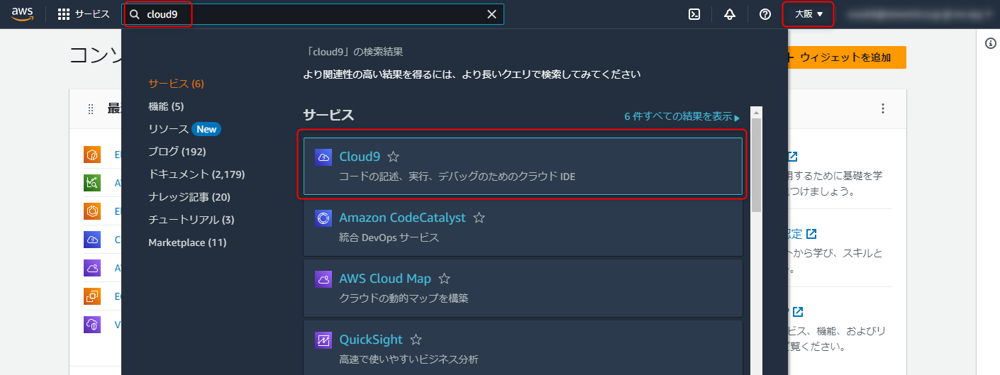  

2. **環境を作成** をクリックします。  
   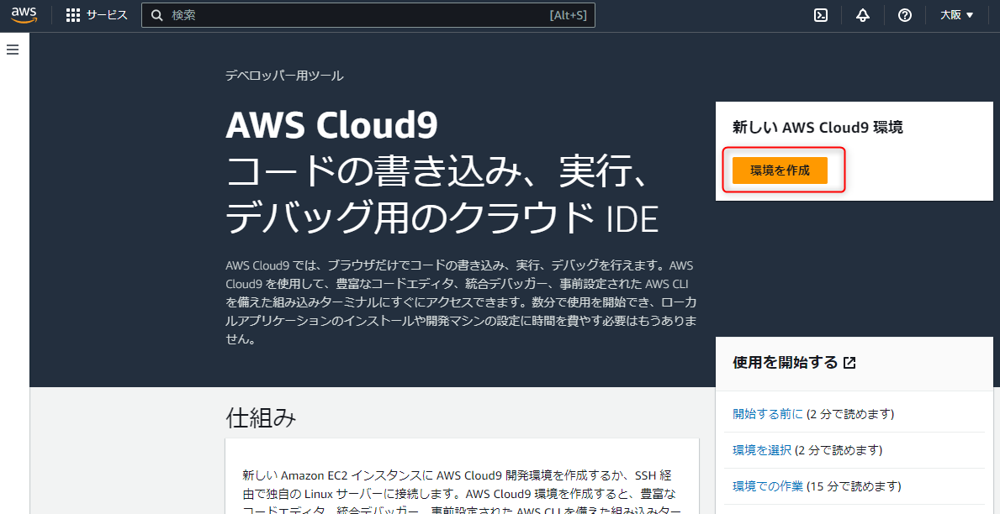  

3. 名前を指定し、その他はなにも変更せずに作成します。
   |設定|値|
   |:--|:--|
   |名前|fcs-handson|
   |環境タイプ|新しいEC2インスタンス|
   |インスタンスタイプ|t3.small|
   |プラットホーム|Amazon Linux 2|
   |タイムアウト|30分|
   |接続|AWS System Manager|  

   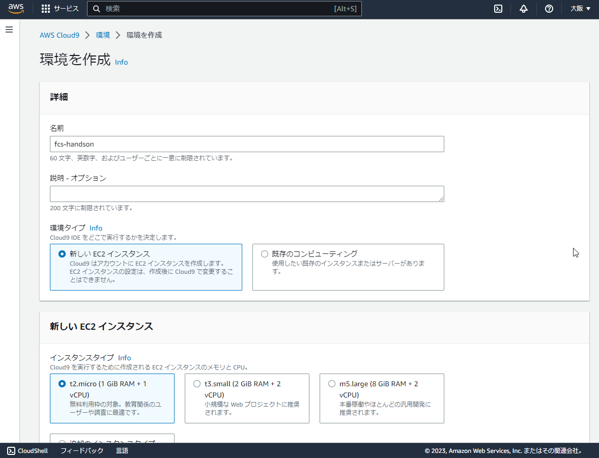  

4. Cloud9 IDEを開きます。  
   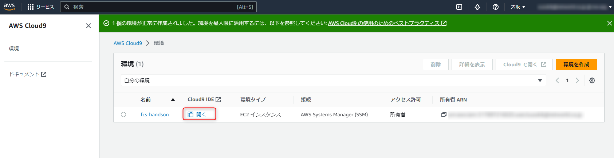   

5. **Terminal** を開きます。  
   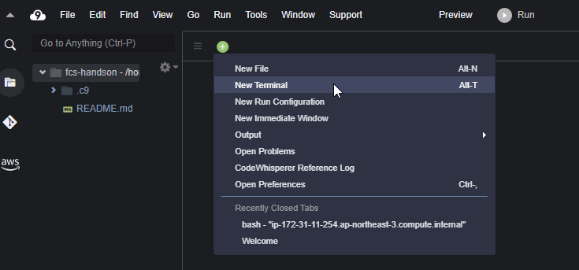  

6. `sudo yum install -y jq` を実行しアプリケーションをインストールします。

7. 必要なアプリケーションがすべてインストールされていることを確認します。  
   ```
   aws --version
   terraform -version
   git -v
   jq --version  
   ```

## ハンズオン用AWS環境作成  
ハンズオン用のAWS環境をTerraformを利用して作成します。  
手順実施前に自身がどのディレクトリで作業しているか確認してください。
ディレクトリが異なる場合は適宜読み替えてください。  

```
~/environment $ pwd
/home/ec2-user/environment
```

1. `git clone https://github.com/keisz/Falcon-FCS-onECS-Handson.git` を実行し、Githubからリポジトリをクローンします。  
   
2. `cd Falcon-FCS-onECS-Handson/deploy/` でディレクトリを移動します。  

3. 左ペインのフォルダ/ファイルリストで *Falcon-FCS-onECS-Handson -> deploy* と展開し、**terraform.tfvars.example**を右クリックし、*Duplicate* をクリックします。  
   ファイルがコピーされます。
   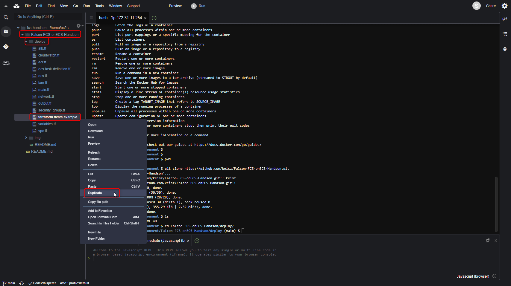  

4. コピーされたファイル *terraform.tfvars.1.example* を **terraform.tfvars** にファイル名を変更します。
   *terraform.tfvars.1.example* を右クリックして*Rename*をクリックして変更します。  
   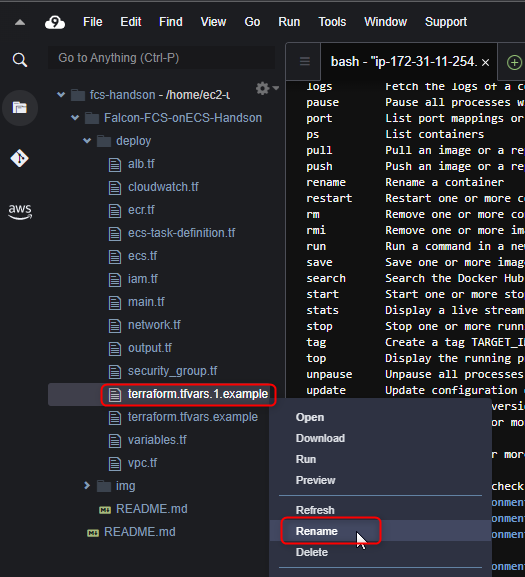  

   > AWSのリージョンを変更したい場合はterraform.tfvarsの**aws_region**と**availability_zones**を変更してください。  
   > 東京リージョンを利用する場合は下記のようになります。    
   > **aws_region     = "ap-northeast-1"**  
   > **availability_zones = ["ap-northeast-1a"]**  

   > 同一リージョンに複数の環境を作成する場合は **app_name**,**app_name_auto_detection**,**app_environment** の値を任意の値に変更してください。  

5. Terminalで下記コマンド実行して、AWS Access KeyとSecret Keyを環境変数に指定します。  
   ※ 下記の値はサンプルです。自身のAccess keyとSecret Keyに置き換えてください。  
   ```
   export AWS_ACCESS_KEY_ID="abcdefghijkasdfghjkl"
   export AWS_SECRET_ACCESS_KEY="qaz2wsx3edc4rfv5tgb6yhn7ujm8iklo90p"
   ```

6. `terraform init` を実行後、`terraform plan`を実行し、エラーが出ないことを確認します。  

7. `terraform apply -auto-approve` を実行し、AWS上にリソースを作成します。  

8. 正常に終了すると下記のような結果がアプトプットされます。  
   この後に使うのでメモしてください。  
   ```  
   Apply complete! Resources: 26 added, 0 changed, 0 destroyed.

   Outputs:

   alb_dns_name = "web-dvwa-ecs-demo-alb-69220195.ap-northeast-3.elb.amazonaws.com"
   alb_dns_name_auto_detection = "detection-container-ecs-demo-alb-216119334.ap-northeast-3.elb.amazonaws.com"
   falcon-sensor_repository_url = "123456789012.dkr.ecr.ap-northeast-3.amazonaws.com/falcon-sensor"
   ```  

9. 完了時に表示された、*alb_dns_name* と *alb_dns_name_auto_detection* のURLにWebブラウザでアクセスします。  
   画像のように表示されることを確認します。  
   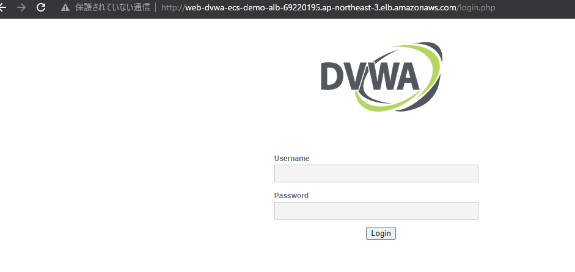  
   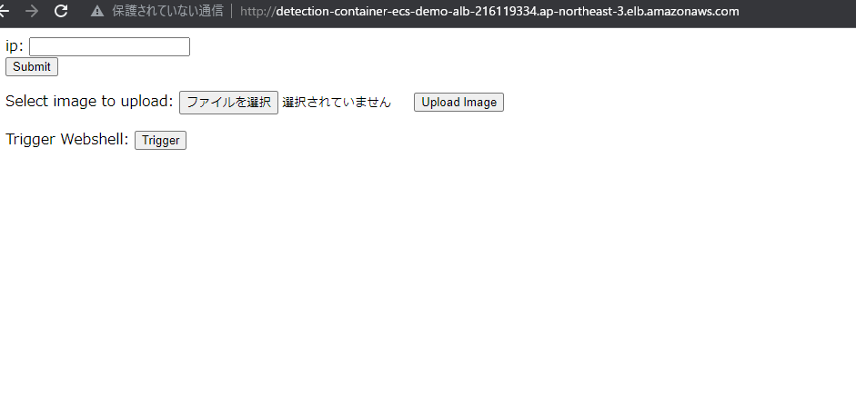  


## FCS Container Security ハンズオン  
ECSで動作しているコンテナーをFalcon Container Sensorを利用して保護します。  
ハンズオンの手順は下記になります。  

a. Falcon API Keyの作成  
b. Falcon Container SensorのURI確認     
c. Falcon SensorのPullとECRへのPUSH  
d. ECSタスク定義にFalcon Sensorの設定を挿入  
e. ECSサービスを更新し、Falcon Sensorによる保護を実行  
f. Falcon Sensorによる検知テスト  

### a. Falcon API Keyの作成   
1. Falconコンソールで、「API Clients and Keys（APIクライアントおよびキー）」（「Support and resources（サポートおよびリソース）」 > 「Resources and tools（リソースおよびツール）」 > 「API clients and keys（APIクライアントおよびキー）」）に移動します。  
   
2. 「Add new API client（新しいAPIクライアントの追加）」をクリックします。  
   
3. リストの「Falcon Images Download（Falconイメージのダウンロード）」オプションの「Read（読み取り）」を選択します。 

4. リストの「Sensor Download」オプションの 「Read（読み取り）」を選択します。  
   これはCIDの情報を取得するために使用します。  
   
5. 「Add（追加）」をクリックし、クライアントIDとクライアントシークレットをメモします。 

### b. Falcon Container SensorのURI確認    
展開するFalcon Container SensorのURL（コンテナレジストリのURLとコンテナバージョン）を確認します。  
URIの命名規則は下記です。    
   `[YOUR REGISTRY].crowdstrike.com/falcon-container/[YOUR CLOUD LOWER]/release/falcon-sensor:<VERSION>.container.x86_64.Release.[YOUR CLOUD]`    
それぞれの値はFalconのリージョンにより異なります。  
US-2リージョンの場合は下記のようになります。  
|||  
|:--|:--|  
|[YOUR REGISTRY]|registry|  
|[YOUR CLOUD LOWER]|us-2|  
|[YOUR CLOUD]|US-2|  

バージョンは[Falcon Support PortalのSensor Release Matrix:Container Sensor Release](https://supportportal.crowdstrike.com/s/article/Sensor-Release-Matrix-Container)から最新のリリースノートを確認してください。  
[2023/7/12時点のバージョン](https://supportportal.crowdstrike.com/s/article/Release-Notes-Falcon-Container-Sensor-6-57-4001)は **6.57.0-4001** です。  
*To download the 6.57 image from the CrowdStrike registry, use 6.57.0-4001 as the <VERSION> for the Falcon Container sensor filename. Refer to Falcon Container Sensor for Linux Deployment US-1 | US-2 | EU-1 | US-GOV-1 for details.To download the 6.57 image from the CrowdStrike registry, use 6.57.0-4001 as the <VERSION> for the Falcon Container sensor filename. Refer to Falcon Container Sensor for Linux Deployment US-1 | US-2 | EU-1 | US-GOV-1 for details.*  

US-2且つ2023/7/12時点の最新バージョンの場合、URIは下記のようになります。  
`registry.crowdstrike.com/falcon-container/us-2/release/falcon-sensor:6.57.0-4001.container.x86_64.Release.US-2`  


### c. Falcon SensorのPullとECRへのPUSH  
1. 環境変数の指定  
   以下の環境変数を指定します。  

   |No,|変数名|指定する内容|サンプル|
   |:--|:--|:--|:--|
   |1|ECR_FALCON_SENSOR_URI|Terraform実行完了後に表示された"falcon-sensor_repository_url"の値|123456789012.dkr.ecr.ap-northeast-3.amazonaws.com/falcon-sensor|
   |2|ECR_URI|Terraform実行完了後に表示された"falcon-sensor_repository_url"の"/falcon-sensor"を抜いた値|123456789012.dkr.ecr.ap-northeast-3.amazonaws.com|
   |3|CS_CLIENT_ID|"a. Falcon API Keyの作成"で作成したAPIクライアントID||
   |4|CS_CLIENT_SECRET|"a. Falcon API Keyの作成"で作成したAPIクライアントシークレット|| 
   |5|FALCON_IMAGE_URI|"b. Falcon Container SensorのURI確認"で確認したURI|registry.crowdstrike.com/falcon-container/us-2/release/falcon-sensor:6.57.0-4001.container.x86_64.Release.US-2|
   |6|FALCON_IMAGE_URI_TAG|"b. Falcon Container SensorのURI確認"で確認したURIのタグ部分|6.57.0-4001.container.x86_64.Release.US-2|  
   
   下記コマンドを実行します。  

   ```
   export ECR_FALCON_SENSOR_URI="(1の値)"
   export ECR_URI="(2の値)"
   export CS_CLIENT_ID="(3の値)"
   export CS_CLIENT_SECRET="(4の値)"
   export FALCON_IMAGE_URI="(5の値)"
   export FALCON_IMAGE_URI_TAG="(6の値)"
   ```

   - sample  
   ```
   export ECR_FALCON_SENSOR_URI="123456789012.dkr.ecr.ap-northeast-3.amazonaws.com/falcon-sensor"
   export ECR_URI="123456789012.dkr.ecr.ap-northeast-3.amazonaws.com"
   export CS_CLIENT_ID="00000000000000000000000"
   export CS_CLIENT_SECRET="aaaaaaaaaaaaaaaaaaaaaaaaaaaaaaaaaaaaa"
   export FALCON_IMAGE_URI="registry.crowdstrike.com/falcon-container/us-2/release/falcon-sensor:6.57.0-4001.container.x86_64.Release.US-2"
   export FALCON_IMAGE_URI_TAG="6.57.0-4001.container.x86_64.Release.US-2"
   ```

2. Falcon APIに oauth2でログインし、BEARER_TOKENを変数に指定します。
   ```
   RESPONSE=$(curl \
   --data "client_id=${CS_CLIENT_ID}&client_secret=${CS_CLIENT_SECRET}" \
   --request POST \
   --silent https://api.us-2.crowdstrike.com/oauth2/token)

   export BEARER_TOKEN=$(echo $RESPONSE | jq -r .access_token)

   echo $RESPONSE
   echo $BEARER_TOKEN
   ```  

3. CrowdStrike コンテナレジストリへのログイン情報を取得と変数に指定します。  
   ```
   export ART_PASSWORD=$(curl -X GET -H "authorization: Bearer ${BEARER_TOKEN}" https://api.us-2.crowdstrike.com/container-security/entities/image-registry-credentials/v1 | jq -r .resources[0].token)
   export CID=$(curl -X GET -H "authorization: Bearer ${BEARER_TOKEN}" https://api.us-2.crowdstrike.com/sensors/queries/installers/ccid/v1 | jq -r .resources[0] | cut -c 1-32)
   export INSTALL_CID=$(curl -X GET -H "authorization: Bearer ${BEARER_TOKEN}" https://api.us-2.crowdstrike.com/sensors/queries/installers/ccid/v1 | jq -r .resources[0])

   export ART_USERNAME=fc-${CID}

   echo $CID
   echo $INSTALL_CID
   echo $ART_USERNAME
   echo $ART_PASSWORD
   ```

   > "$INSTALL_CID"の値はFalcon Sensorを設定するときに利用します。  

4. 必要な環境変数が登録されていることを確認します。  
   ```
   echo $ECR_FALCON_SENSOR_URI
   echo $ART_USERNAME
   echo $ART_PASSWORD
   echo $FALCON_IMAGE_URI
   echo $FALCON_IMAGE_URI_TAG
   ```

5. CrowdStrike コンテナレジストリにログインします。  
   `docker login --username  ${ART_USERNAME} --password ${ART_PASSWORD} registry.crowdstrike.com`   

6. Falcon SensorコンテナイメージをPullします。  
    `docker pull $FALCON_IMAGE_URI`  

7. コンテナイメージがCloud9上にPull出来ていることを確認します。  
   `docker images`

   - 結果サンプル  
   ```
    $ docker images
   REPOSITORY                                                             TAG                                         IMAGE ID       CREATED       SIZE
   registry.crowdstrike.com/falcon-container/us-2/release/falcon-sensor   6.57.0-4001.container.x86_64.Release.US-2   372b0536137e   5 weeks ago   125MB
   ```  

8. pullしたFalcon Sensor コンテナイメージにタグ付けをし、ECRにPushします。  
   ```
   docker tag $FALCON_IMAGE_URI "${ECR_FALCON_SENSOR_URI}:${FALCON_IMAGE_URI_TAG}"  
   docker images
   aws ecr get-login-password | docker login --username AWS --password-stdin ${ECR_URI}
   docker push "${ECR_FALCON_SENSOR_URI}:${FALCON_IMAGE_URI_TAG}"
   ```

   - 結果サンプル  
   ```
   $ docker tag $FALCON_IMAGE_URI "${ECR_FALCON_SENSOR_URI}:${FALCON_IMAGE_URI_TAG}"
   $ docker images
   REPOSITORY                                                             TAG                                         IMAGE ID       CREATED       SIZE
   123456789012.dkr.ecr.ap-northeast-3.amazonaws.com/falcon-sensor        6.57.0-4001.container.x86_64.Release.US-2   372b0536137e   5 weeks ago   125MB
   registry.crowdstrike.com/falcon-container/us-2/release/falcon-sensor   6.57.0-4001.container.x86_64.Release.US-2   372b0536137e   5 weeks ago   125MB

   $ aws ecr get-login-password | docker login --username AWS --password-stdin ${ECR_URI}
   WARNING! Your password will be stored unencrypted in /home/ec2-user/.docker/config.json.
   Configure a credential helper to remove this warning. See
   https://docs.docker.com/engine/reference/commandline/login/#credentials-store

   Login Succeeded

   $ docker push "${ECR_FALCON_SENSOR_URI}:${FALCON_IMAGE_URI_TAG}"
   The push refers to repository [123456789012.dkr.ecr.ap-northeast-3.amazonaws.com/falcon-sensor]
   46f61cd15c7e: Pushed 
   31af4a28cbd9: Pushed 
   4deb43649c66: Pushed 
   6.57.0-4001.container.x86_64.Release.US-2: digest: sha256:af9b8b8fb23e2c138a838bde36ccdf828fd83c82dc1923dc0f03cead3142f4ed size: 953
   ```  

9. コマンドを実行し、ECRにコンテナイメージが登録されていることを確認します。  
   `aws ecr list-images --repository-name falcon-sensor --query "imageIds[*].imageTag" --output table`  

   - 結果サンプル  
   ```
   $ aws ecr list-images --repository-name falcon-sensor --query "imageIds[*].imageTag" --output table
   -----------------------------------------------
   |                 ListImages                  |
   +---------------------------------------------+
   |  6.57.0-4001.container.x86_64.Release.US-2  |
   +---------------------------------------------+
   ```

### d. ECSタスク定義にFalcon Sensorの設定を挿入
ECSタスク定義にFalcon Sensorの設定を挿入します。  

1. AWS マネジメントコンソールで"Elastic Container Service"のページを開き、**タスク定義**をクリックします。  
   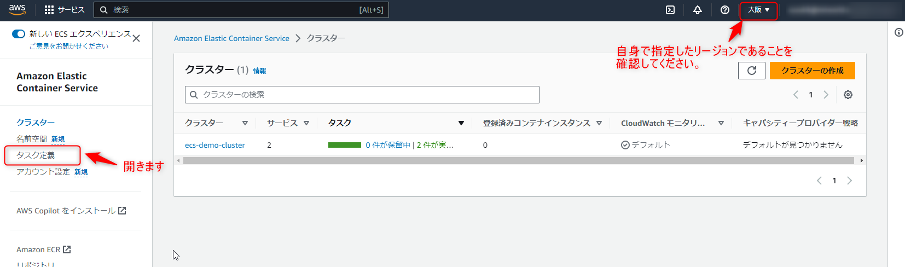  

2. *web-dvwa-task* をクリックします。  
   > Terraform実行時に*app_name*を変更した場合は異なる名前になっています。  

3. 番号の大きい(通常は1です)タスク定義にチェックをつけ、*新しいリビジョンの作成 -> JSONを使用した新しいリビジョンの作成* をクリックします。  
     

4. 表示されている*task_definition.json*の中身をすべてコピーします。  
   この画面はあとから利用するので閉じません。
   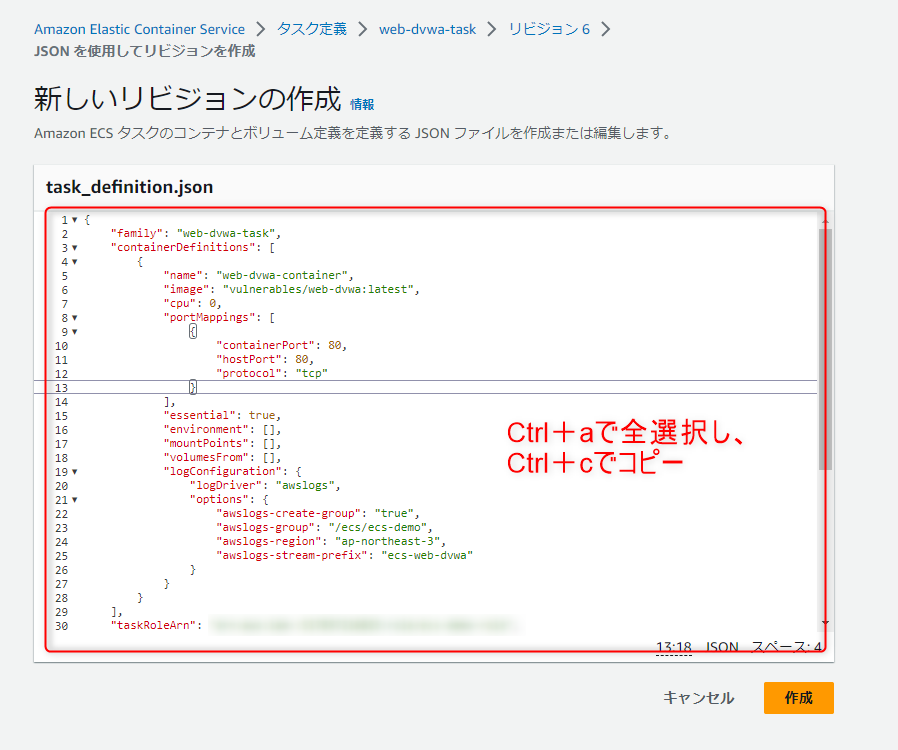  


5. Cloud9の画面に戻ります。 
   ターミナル画面で、`cd /home/ec2-user/environment` に移動します。  

6. 左ペインのファイル/フォルダのリストで、一番上のフォルダを右クリックし、**New file** をクリックします。 
   ファイル名の指定画面になりますので、**web-dvwa-task-taskdefinition.json** と入力、Enterしファイル名を確定します。   
   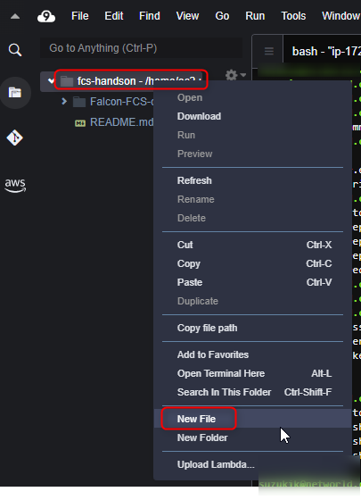  

7. *web-dvwa-task-taskdefinition.json*をダブルクリックすると右ペインにファイルが開きます。
   4.でコピーした内容を貼り付け、Ctrl+s で保存します。  

8. 右ペインのターミナルのタブをクリックします。  
   `ls`を実行し、**web-dvwa-task-taskdefinition.json**が存在することを確認します。  

9.  作業に必要な環境変数が設定されていることを確認します。  
   ```
   echo $INSTALL_CID
   echo $ECR_FALCON_SENSOR_URI
   echo $ECR_URI   
   echo $FALCON_IMAGE_URI_TAG
   ```

10. ECRにログインし、Pull Secretを環境変数に指定します。  
   ```
   aws ecr get-login-password | docker login --username AWS --password-stdin ${ECR_URI}
   IMAGE_PULL_TOKEN=$(cat ~/.docker/config.json | base64 -w 0)
   echo $IMAGE_PULL_TOKEN
   ```

11. Falcon Sensorを挿入するタスク定義を作成します。  

   ```
   docker run -v $PWD:/var/run/spec --rm $ECR_FALCON_SENSOR_URI:$FALCON_IMAGE_URI_TAG \
      -cid $INSTALL_CID \
      -image $ECR_FALCON_SENSOR_URI:$FALCON_IMAGE_URI_TAG \
      -ecs-spec-file /var/run/spec/web-dvwa-task-taskdefinition.json \
      -pulltoken "$IMAGE_PULL_TOKEN" > web-dvwa-task-taskdefinition-falcon.json
   ```

12. 作成された*web-dvwa-task-taskdefinition-falcon.json*を開き、*web-dvwa-task-taskdefinition.jsonと比較して内容が変わっていることを確認します。  
    
13. *web-dvwa-task-taskdefinition-falcon.json*の内容をすべてコピーします。  

14. "4."で開いていたAWSマネジメントコンソールのタスク定義のjson画面を表示します。  
    コピーした内容をすべては貼り付け（上書き）、作成をクリックします。  
    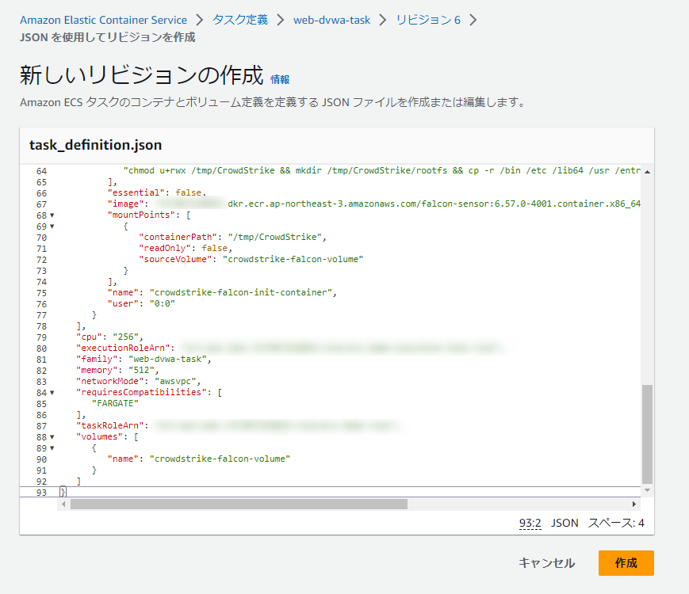  

15. タスク定義が正常に作成されたことを確認します。  
    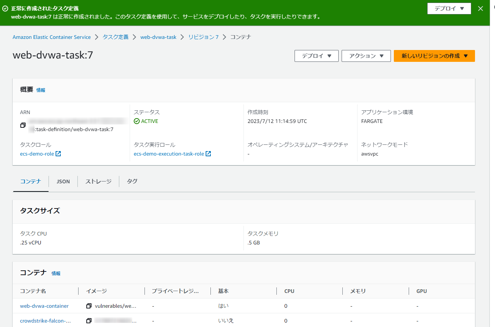  


16. 同様の手順で、もう一つのタスク定義 **detection-container-task** にも設定を挿入します。  
    
    > 6.~8. で作成するファイル名を *detection-container-task-taskdefinition.json*   
    > 11. で出力するファイルを *detection-container-task-taskdefinition-falcon.json*  
    > と置き換えて実施します。  
    > 11. のコマンドラインは下記のように置き換えます。   
    
    ```
    docker run -v $PWD:/var/run/spec --rm $ECR_FALCON_SENSOR_URI:$FALCON_IMAGE_URI_TAG \
    -cid $INSTALL_CID \
    -image $ECR_FALCON_SENSOR_URI:$FALCON_IMAGE_URI_TAG \
    -ecs-spec-file /var/run/spec/detection-container-task-taskdefinition.json \
    -pulltoken "$IMAGE_PULL_TOKEN" > detection-container-task-taskdefinition-falcon.json
    ```


### e. ECSサービスを更新し、Falcon Sensorによる保護を実行  
Falcon Sensorの設定を挿入したタスク定義を使って、ECSサービスを更新します。  


1. AWSマネジメントコンソールを開き、*Amazon Elastic Container Service > クラスター > ecs-demo-cluster > サービス > web-dvwa-svc* に移動します。  
   **サービスを更新** を開きます。 
   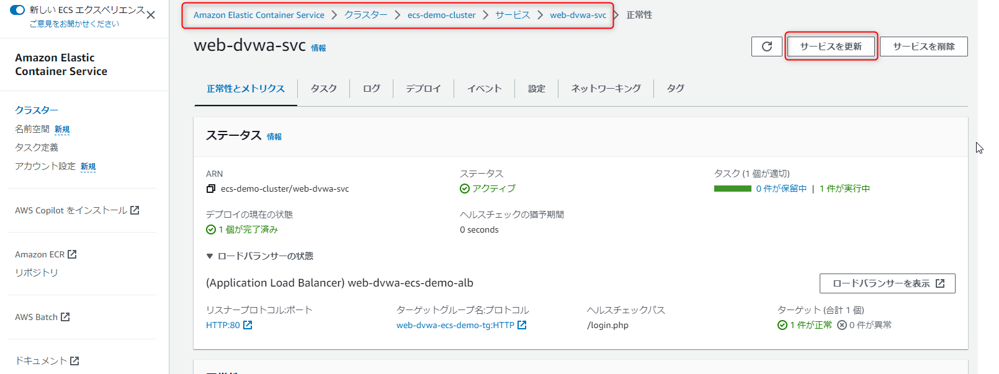  

2. リビジョンを最新のバージョンに変更し、**更新**します。  
   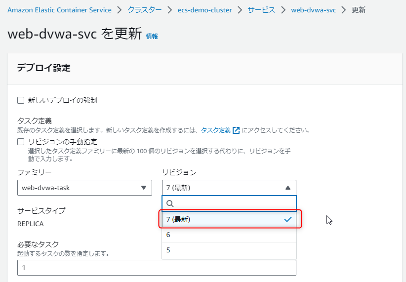    

3. *web-dvwa-svc*のタスクタブを開くと動作しているタスク一覧が表示されます。ここに*リビジョン*が新しいもの(ここでは7)が動き始めていることを確認します。  
   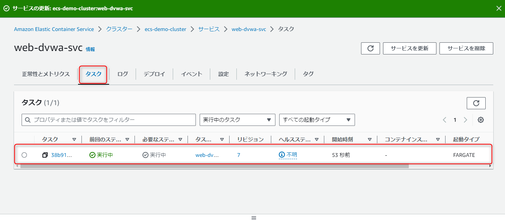  

4. タスクIDをクリックするとタスクの詳細が確認できます。  
   ここで、*crowdstrike-falcon-init-container* が**終了コード 0** で止まっていることを確認します。
   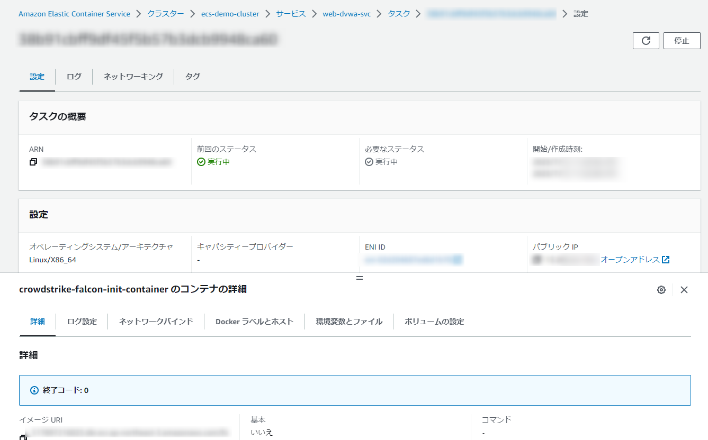  

5. ECSサービス **detection-container-svc** も同様に更新します。  

### f. Falcon Sensorによる検知テスト  
Command Injectionを実行し、Falcon上で検知されるか確認します。  

#### web-dvwa-svc の検知  
1. Terraformを実行した際のOutputのうち、**alb_dns_name**のURLにアクセスします。  

   ```  
   Apply complete! Resources: 26 added, 0 changed, 0 destroyed.

   Outputs:

   alb_dns_name = "web-dvwa-ecs-demo-alb-69220195.ap-northeast-3.elb.amazonaws.com"
   alb_dns_name_auto_detection = "detection-container-ecs-demo-alb-216119334.ap-northeast-3.elb.amazonaws.com"
   falcon-sensor_repository_url = "123456789012.dkr.ecr.ap-northeast-3.amazonaws.com/falcon-sensor"
   ``` 

2.  Webサービスを開きログインします。  
   user: admin  
   password: password  
   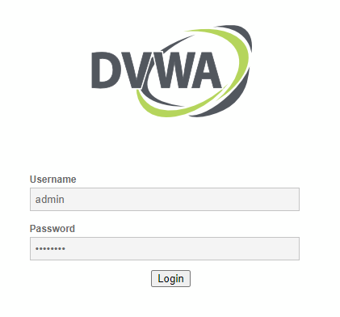  

3. **Create/Reset Database** をクリックします。

4. ログイン画面に戻るので再度ログインします。  
   
5. メニューの*Command Injection* を開きます。  
   *Enter an IP address:* に `; /bin/cat /etc/passwd ;`を入力し、Submitします。  
   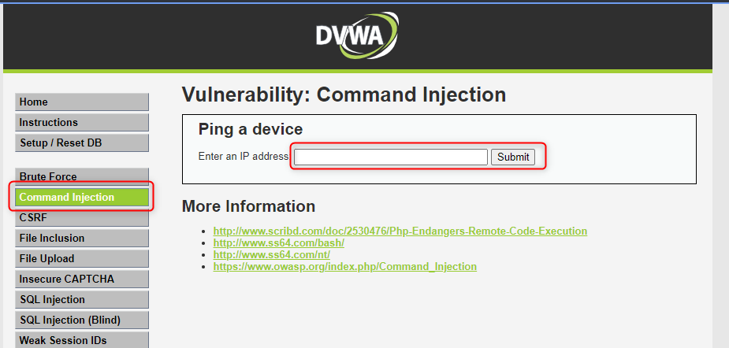  

6. */etc/passwd* の内容が表示されます。  

7. Falcon コンソールを開き、アクティビティダッシュボードの最新の検知を開きます。  
   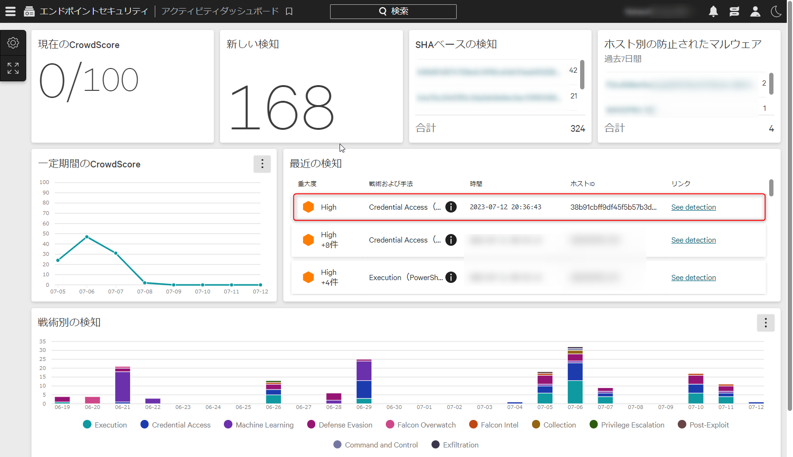  

8. 検知の詳細の*コマンドライン*で **; /bin/cat /etc/passwd ;** が実行された記録を確認します。  
   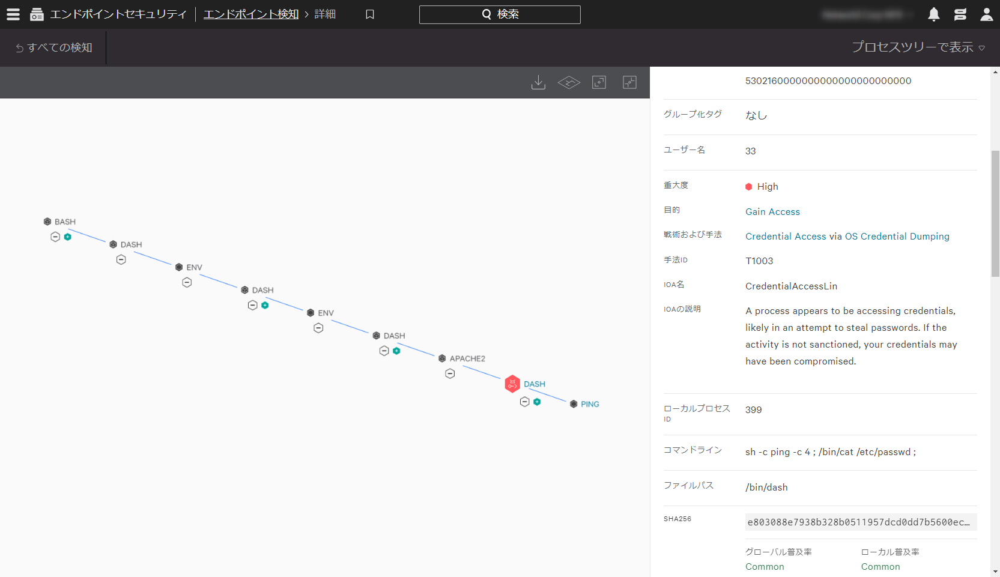  


#### detection-container-svc の検知  
1. Terraformを実行した際のOutputのうち、**alb_dns_name_auto_detection**のURLにアクセスします。  

   ```  
   Apply complete! Resources: 26 added, 0 changed, 0 destroyed.

   Outputs:

   alb_dns_name = "web-dvwa-ecs-demo-alb-69220195.ap-northeast-3.elb.amazonaws.com"
   alb_dns_name_auto_detection = "detection-container-ecs-demo-alb-216119334.ap-northeast-3.elb.amazonaws.com"
   falcon-sensor_repository_url = "123456789012.dkr.ecr.ap-northeast-3.amazonaws.com/falcon-sensor"
   ``` 

2. *ip* の入力画面に `; /bin/cat /etc/passwd ;` を入力し、**Submit** をクリックします。  
   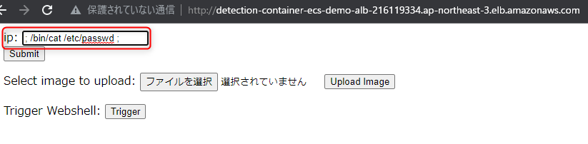  

3. Falcon コンソールを開き、アクティビティダッシュボードの最新の検知を開きます。  
   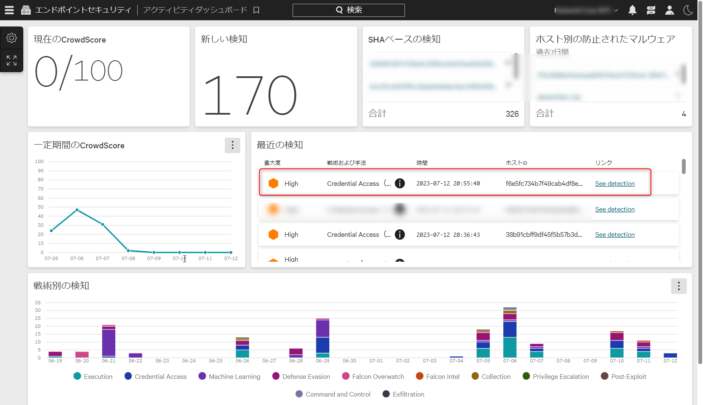  

4. 検知の詳細の*コマンドライン*で **; /bin/cat /etc/passwd ;** が実行された記録を確認します。
   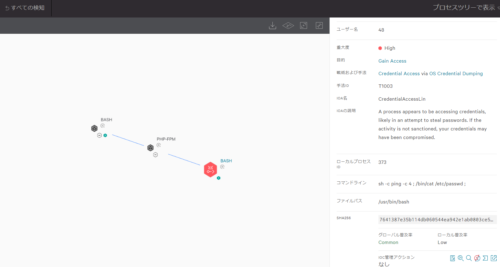  


### 【Additional】 Falcon Sensorによる様々な検知内容   
ECSサービス *detection-container-svc* で動かしているコンテナはランダムに脅威が検知されるように作られています。  
ECSサービスを稼働した状態にしておくと、ランダムにFalconコンソール上で脅威が検知されます。  
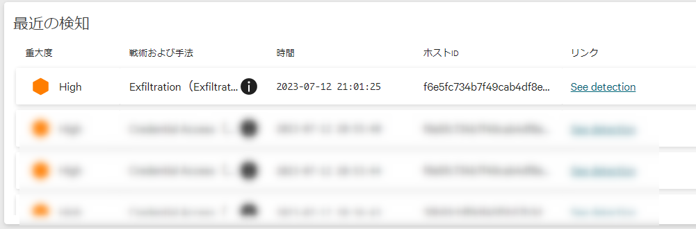  


## お片付け  
ハンズオンで作成した環境を削除します。  
`terraform destroy`を実行することでAWSマネジメントコンソールで作成したリソース以外はすべて削除されます。  

### terraform destroy の実行  
1. Cloud9のターミナルを開き、`~/environment/Falcon-FCS-onECS-Handson/deploy` に移動します。  
   `cd ~/environment/Falcon-FCS-onECS-Handson/deploy`  

2. `terraform destroy` を実行します。削除するリソースを確認し、**yes** を入力後Enterで削除を開始します。  
   
3. AWS マネジメントコンソールからECSのタスク定義とCloud9を削除します。  
   

--